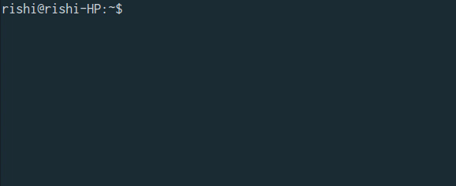

# 

> Command line tool to track activities of a Github user

<h1 align="center">
<br>

<br>
<br>
<a "https://travis-ci.org/CodeDotJS/gictivity-cli">

</a>
</h1> 

## Install

- `Ensure you've node.js version >=4 installed. Then run the following :`

```sh
$ npm install --global gictivity-cli
```
__`OR`__
```sh
$ sudo npm install --global gictivity-cli
```

## Usage

```
 Usage   : gic [command] <username>

 Command :
 -p, --pinned     Pinned repository of a github user
 -d, --day        Total contributions made in a day
 -h, --half       Total contributions made in 3 days
 -w, --week       Total contributions made in a complete week
 -m, --month      Total contributions made in a month
 -y, --year       Total commits pushed in a year
```

## Related

- [gictivity](https://github.com/CodeDotJS/gictivity) : API for this tool

- [stafo](https://github.com/CodeDotJS/stafo-cli) : CLI Too to fetch total stars and forks on a github repository

## License

MIT &copy; [Rishi Giri](http://rishigiri.com)
